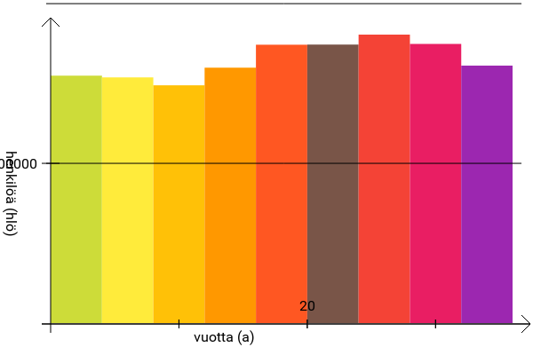

# Histogrammi

Tämä ohjelma tuottaa annetusta datasta matemaattisilta merkinnöiltään oikeellisia histogrammeja. Ohjelma on tarkoitettu opetuskäyttöön, mutta se ei ole siihen rajoitettu. Käytetty tekniikka on HTML5 + CSS3, joten se ei vaadi riippuvuuksia, eikä se ole sidonnainen tiettyyn alustaan.

Tältä voi esimerkiksi näyttää ohjelman tuottama kuvaaja (Suomessa ssa eläneiden, alle 50 vuotiaiden miesten ikäjakauma)

## Asennus

Histogrammi-sovelluksen asennat lataamalla .zip -tiedoston [tästä](https://github.com/nomelif/histogrammi/archive/master.zip). Pura .zip -kansio ja avaa selaimella (Internet Explorer, joka on vanhempi kuin 10 ei ole tuettu, IE 10 käyttäytyy itsekin hieman oudosti.) tiedosto index.html. Ohjelma ei toimi, jos puretaan vain index.html -tiedosto, vaan se vaatii toimiakseen kaikki arkiston tedostot.

### Purkaminen Unixeilla ja Linux® -alustalla

Purkaminen hoituu Unix-tyyppisellä alustalla (esim. Linux®) esimerkiksi näin:

    $ unzip histogrammi-master.zip

Graafinen ratkaisu vaihtelee tarkan distribuution ja työpöydän perusteella, mutta yleensä se on muotoa: Avaa tiedostoselain > Navigoi Arkiston sisältävään kansion > Vasen napautus > Pura.

### Purkaminen Microsoft Windows -alustalla

Microsoft Windows-käyttöjärjestelmällä purkaminen hoituu: Resurssien hallinta > Vasen painallus > Pura Kaikki. Seuraa sitten näytöllä näkyviä ohjeita.

### Purkaminen Mac OSX -alustalla

Mac OSX -käyttöjärjestelmä purkaa yleensä arkistot automaattisesti. Jos tämä ei toimi, arkiston kaksoisnapauttaminen ratkaissee ongelman.

## Lisenssi

(Suomeksi pähkinänkuoressa: Saat käyttää, muokata ja jakaa alukuperäistä ohjelmaa sekä muokkaamiasi versioita vapaasti ja mihin tahansa tarkoitukseen.)

Copyright (c) 2014 Théo Friberg

Permission is hereby granted, free of charge, to any person obtaining
a copy of this software and associated documentation files (the
"Software"), to deal in the Software without restriction, including
without limitation the rights to use, copy, modify, merge, publish,
distribute, sublicense, and/or sell copies of the Software, and to
permit persons to whom the Software is furnished to do so, subject to
the following conditions:

The above copyright notice and this permission notice shall be included
in all copies or substantial portions of the Software.

THE SOFTWARE IS PROVIDED "AS IS", WITHOUT WARRANTY OF ANY KIND,
EXPRESS OR IMPLIED, INCLUDING BUT NOT LIMITED TO THE WARRANTIES OF
MERCHANTABILITY, FITNESS FOR A PARTICULAR PURPOSE AND NONINFRINGEMENT.
IN NO EVENT SHALL THE AUTHORS OR COPYRIGHT HOLDERS BE LIABLE FOR ANY
CLAIM, DAMAGES OR OTHER LIABILITY, WHETHER IN AN ACTION OF CONTRACT,
TORT OR OTHERWISE, ARISING FROM, OUT OF OR IN CONNECTION WITH THE
SOFTWARE OR THE USE OR OTHER DEALINGS IN THE SOFTWARE.
